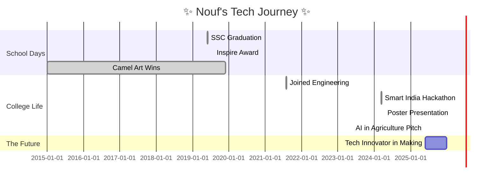

<div align="center">

<h1 align="center">✨ Nouf Bamne ✨</h1>

<p></p>

---

### 🌸 About Me

Hey there! I’m <strong>Nouf Bamne</strong>, a tech-savvy girl with a passion for innovation and an undying love for all things code. I’m currently pursuing <strong>Computer Engineering</strong> at <em>Dr. Babasaheb Ambedkar Technological University</em>, where I’m diving deep into the world of <strong>AI, ML, and full-stack development</strong>. I believe in harnessing technology to build meaningful solutions and inspire change. You’ll often find me participating in hackathons, where I thrive on building fast and learning even faster! 💻⚡

Outside the world of tech, I’m a multifaceted creator – I sketch like an artist, race like an athlete, and sip tea like a connoisseur (seriously, I adore tea!). I’ve always believed that curiosity and creativity go hand in hand. Whether it's building projects, collaborating on exciting ideas, or exploring new tech stacks, I’m always ready for the next challenge. 🌟

Let’s connect, collaborate, and create something magical together! 🎀✨

---

### 🏆 Achievements

<table>
  <tr><th>🏫 School Achievements</th><th>🎓 College Highlights</th></tr>
  <tr>
    <td>
      <ul>
        <li>📚 <strong>SSC Grade</strong>: 91.40%</li>
        <li>🥇 Gold Medal – Science Olympiad (2018)</li>
        <li>🥈 Silver Medal – Science Olympiad (2021)</li>
        <li>🌾 Inspire Award – Modern Agriculture Project Winner (2019)</li>
        <li>🚜 Modern Transport Project Winner (2020)</li>
        <li>🏊‍♀️ State Level – Swimming Champion (2017)</li>
        <li>🏐 District Level – Volleyball Player (2017)</li>
        <li>♟️ Division Level – Chess Champion (2017, 2018)</li>
        <li>🎨 Best Entry – National Level Colouring (2020)</li>
        <li>🖌️ Camel Art Contest Winner (2015, 2017–2019)</li>
      </ul>
    </td>
    <td>
      <ul>
        <li>🎯 Finalist – Smart India Hackathon 2024</li>
        <li>🧾 Poster Presentation – Gharda Institute of Technology 2024</li>
        <li>💡 Project: Smart Farming Assistant for Disease Prediction using Deep Learning</li>
        <li>🌱 Startup Pitch – AI in Agriculture Innovation (2025)</li>
      </ul>
    </td>
  </tr>
</table>

<sub><em>School: Ideal English School Shaikh Husain Kazi English High School and Junior College, Mahad-Raigad</em></sub>

---

### 🛠️ Languages, Tools & Frameworks

**Languages**


**Frontend**


**Backend & Database**


**AI/ML Tools**


**Other Tools**


---

### 📈 GitHub Stats & Streaks

<p align="center">
  
  
  
</p>

---

### 📦 Featured Repositories

```markdown
> 🚀 Stay tuned! My top projects with glowing effects and project highlights are coming soon!
```

---

### 📅 My Journey



---

### 🌐 Connect With Me

[](mailto:noufbamne@gmail.com)
[](https://instagram.com/nouf_bamne)
[](https://linkedin.com/in/nouf-bamne)

---

### 💫 Quote to Live By

> “Magic happens when you don’t give up, even when you want to. The universe always falls in love with a stubborn heart.” 🌌

---

<p align="center">
  
</p>

<style>
  h3, h2, h1 {
    font-family: 'Segoe UI', 'Fira Code', 'Cursive';
  }
</style>

<!-- Theme & Aesthetic: tokyo night, sparkly animations, glowing badges, elegant containers -->
