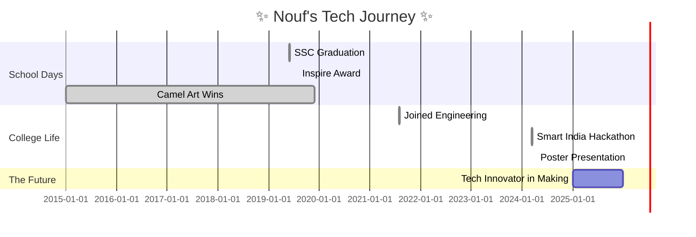

<h1 align="center">✨ Nouf Bamne ✨</h1>

---

### 🌸 About Me

Hey there! I’m <strong>Nouf Bamne</strong>, a tech-savvy girl with a passion for innovation and an undying love for all things code. I’m currently pursuing <strong>Computer Engineering</strong> at <em>Dr. Babasaheb Ambedkar Technological University</em>, where I’m diving deep into the world of <strong>AI, ML, and full-stack development</strong>. I believe in harnessing technology to build meaningful solutions and inspire change. You’ll often find me participating in hackathons, where I thrive on building fast and learning even faster! 💻⚡

Outside the world of tech, I’m a multifaceted creator – I sketch like an artist, race like an athlete, and sip tea like a connoisseur (seriously, I adore tea!). I’ve always believed that curiosity and creativity go hand in hand. Whether it's building projects, collaborating on exciting ideas, or exploring new tech stacks, I’m always ready for the next challenge. 🌟

Let’s connect, collaborate, and create something magical together! 🎀✨

---

### 🏆 Achievements

- 📚 **SSC Grade**: 91.40%
- 🥇 Gold Medalist – Science Olympiad (2018)
- 🥈 Silver Medalist – Science Olympiad (2021)
- 🌾 Zonal Level Inspire Award – Modern Agriculture Project Winner (2019)
- 🚜 Taluka & District Level – Modern Transport Project Winner (2020)
- 🏊‍♀️ State Level – Swimming Champion (2017)
- 🏐 District Level – Volleyball Player (2017)
- ♟️ Division Level – Chess Champion (2017, 2018)
- 🎨 National Level – Best Entry in Colouring (2020)
- 🖌️ Camel Art Contest Winner – (2015, 2017, 2018, 2019)

<em>School: Ideal English School Shaikh Husain Kazi English High School and Junior College, Mahad-Raigad</em>

---

### 🎓 College Highlights

- 🎯 Finalist – Smart India Hackathon 2024
- 🧾 Poster Presentation – Gharda Institute of Technology 2024

---

### 📅 My Journey

---

### ✨ Tech Stack & Tools

---

### 🌐 Connect With Me

---

### 💫 Quote to Live By

> “Magic happens when you don’t give up, even when you want to. The universe always falls in love with a stubborn heart.” 🌌

---

  

<!-- Theme & Aesthetic: tokyo night, soft dark mode, sparkly hover animations, section dividers with style -->
