<h1 align="center">✨ Nouf Bamne ✨</h1>

---

### 🌸 About Me

Hey there! I’m <strong>Nouf Bamne</strong>, a tech-savvy girl with a passion for innovation and an undying love for all things code. I’m currently pursuing <strong>Computer Engineering</strong> at <em>Dr. Babasaheb Ambedkar Technological University</em>, where I’m diving deep into the world of <strong>AI, ML, and full-stack development</strong>. I believe in harnessing technology to build meaningful solutions and inspire change. You’ll often find me participating in hackathons, where I thrive on building fast and learning even faster! 💻⚡

Outside the world of tech, I’m a multifaceted creator – I sketch like an artist, race like an athlete, and sip tea like a connoisseur (seriously, I adore tea!). I’ve always believed that curiosity and creativity go hand in hand. Whether it's building projects, collaborating on exciting ideas, or exploring new tech stacks, I’m always ready for the next challenge. 🌟

Let’s connect, collaborate, and create something magical together! 🎀✨

---
## 🏆 Achievements

<table>
  <tr>
    <th colspan="2" align="center">🎓 School Level</th>
  </tr>
  <tr>
    <td>🏅</td>
    <td>Gold Medalist in Science Olympiad (2018)</td>
  </tr>
  <tr>
    <td>🥈</td>
    <td>Silver Medalist in Science Olympiad (2021)</td>
  </tr>
  <tr>
    <td>🧪</td>
    <td>Zonal Level Inspire Award – Modern Agriculture Project Winner (2019)</td>
  </tr>
  <tr>
    <td>🚗</td>
    <td>Taluka & District Level – Modern Transport Project Winner (2020)</td>
  </tr>
  <tr>
    <td>🏊‍♀️</td>
    <td>State Level Swimming Champion (2017)</td>
  </tr>
  <tr>
    <td>🏐</td>
    <td>District Level Volleyball Player (2017)</td>
  </tr>
  <tr>
    <td>♟️</td>
    <td>Division Level Chess Champion (2017, 2018)</td>
  </tr>
  <tr>
    <td>🎨</td>
    <td>Winner of Camel Art Contest (2015, 2017, 2018, 2019)</td>
  </tr>
  <tr>
    <td>ğŸ–ï¸</td>
    <td>Best Entry in National Level Colouring Competition (2020)</td>
  </tr>
</table>

 

<table>
  <tr>
    <th colspan="2" align="center">🎓 College Level</th>
  </tr>
  <tr>
    <td>ğŸ–ï¸</td>
    <td>Finalist – Smart India Hackathon 2024</td>
  </tr>
  <tr>
    <td>📊</td>
    <td>Poster Presentation Participant – Gharda Institute of Technology (2024)</td>
  </tr>
 
</table>

---

### 🌐 Connect With Me

---

## 💻 Languages & Tools

### 🚀 Development Tools

<table>
<tr>
<td align="center">
   Android
</td>
<td align="center">
   Java
</td>
<td align="center">
   Python
</td>
<td align="center">
   JavaScript
</td>
<td align="center">
   C
</td>
<td align="center">
   C++
</td>
</tr>
<tr>
<td align="center">
   HTML5
</td>
<td align="center">
   CSS3
</td>
<td align="center">
   PHP
</td>
<td align="center">
   React
</td>
<td align="center">
   React Native
</td>
</tr>
<tr>
<td align="center">
   Node.js
</td>
<td align="center">
   MongoDB
</td>
<td align="center">
   MySQL
</td>
<td align="center">
   SQLite
</td>
<td align="center">
   Oracle
</td>
</tr>
<tr>
<td align="center">
   Postman
</td>
<td align="center">
   Heroku
</td>
<td align="center">
   Linux
</td>
<td align="center">
   Figma
</td>
</tr>
<tr>
<td align="center">
   Django
</td>
<td align="center">
   Flask
</td>
<td align="center">
   Ember.js
</td>
<td align="center">
   OpenCV
</td>
</tr>
<tr>
<td align="center">
   Scikit-learn
</td>
<td align="center">
   Seaborn
</td>
<td align="center">
   Pandas
</td>
<td align="center">
   TensorFlow
</td>
<td align="center">
   PyTorch
</td>
</tr>
</table>

---

### 📈 GitHub Stats & Streaks

  
  
  

---

### 📦 Featured Repositories

  

  

---

### 📅 My Journey

```mermaid
gantt
title ✨ Nouf's Tech Journey ✨
dateFormat  YYYY-MM-DD

section School Days
SSC Graduation          :done, 2019-06-01, 1d
Inspire Award            :done, 2019-08-01, 1d
Camel Art Wins          :done, 2015-01-01, 2019-12-01

section College Life
Joined Engineering      :done, 2021-08-01, 1d
Smart India Hackathon   :done, 2024-03-15, 1d
Poster Presentation     :done, 2024-04-10, 1d
CodeSprint DBATU Hackathon :done, 2024-04-28, 1d
AI in Agriculture Pitch :done, 2025-05-25, 1d

section The Future
Tech Innovator in Making :2025-06-01, 2025-12-31
```

---

### 💫 Quote to Live By

> “Magic happens when you don’t give up, even when you want to. The universe always falls in love with a stubborn heart.” 🌌

---

  

<!-- Theme & Aesthetic: tokyo night, sparkly animations, glowing badges, elegant containers -->
